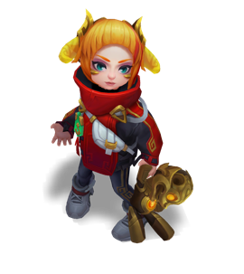
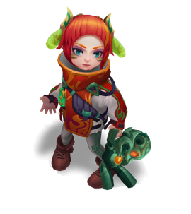

# Application of Variational Autoencoders (VAE) in Generating League of Legends Champions
This repo implements **a Variational Autoencoder (VAE)** model using the PyTorch library, designed to generate new champion images for the game League of Legends. 
 <!-- https://medium.com/@rushikesh.shende/autoencoders-variational-autoencoders-vae-and-%CE%B2-vae-ceba9998773d -->
## Table of Contents
* [Table of Contents](#table-of-contents)
* [VAE Architecture](#vae-architecture)
    + [Decoder](#decoder)
    + [Encoder](#encoder)
* [Results](#results)
* [About Data](#about-data)
* [Details of Traning](#details-of-training)
* [Quick Start](#quick-start)

## VAE Architecture

### Decoder

### Encoder

## Results

## About Data
The data was collected from [**CommunityDragon**](https://www.communitydragon.org/) website, featuring **169** different champions with a total of **6806** images (chroma skin) sized at **270x303** pixels. 

 

These images will be resized to **224x224** pixels to fit the network design. You can adjust the download image size in the `crawl.py` file, but it is necessary to modify the network design to ensure compatibility with the new dimensions.

## Details of Training
Here is the information I have set up for training the model:
```python
epoch = 1000, latent_dim = 64, batch_size = 128
alpha = 3, optimizer = Adam(learning_rate = 0.0001)
```
The model was trained on **Kaggle** using a **P100 GPU**, taking a total of **... hours and ... minutes**.
## Quick Start